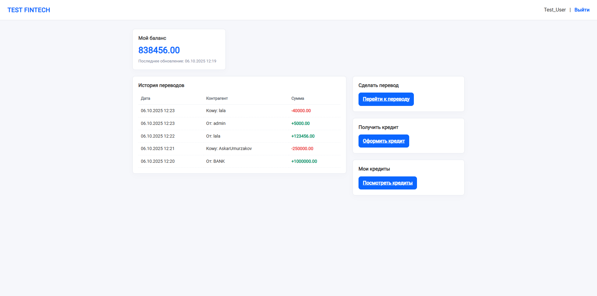
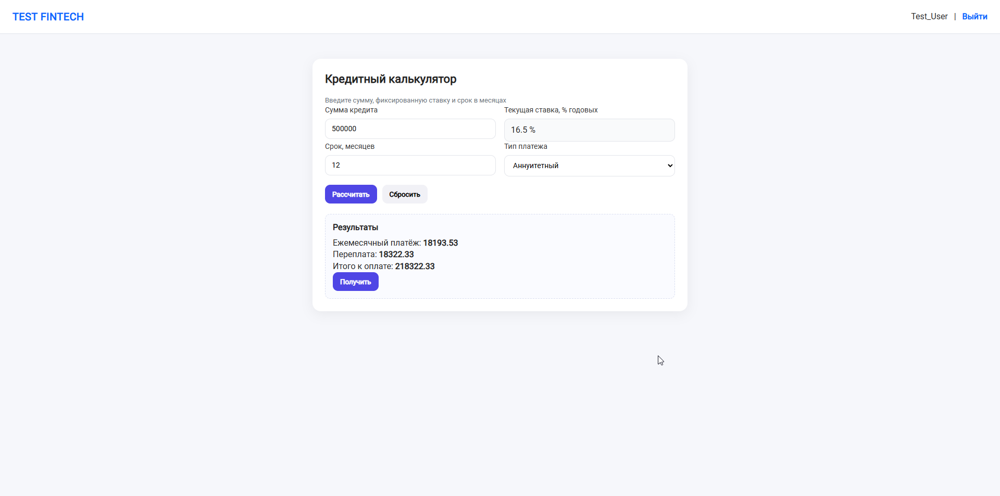
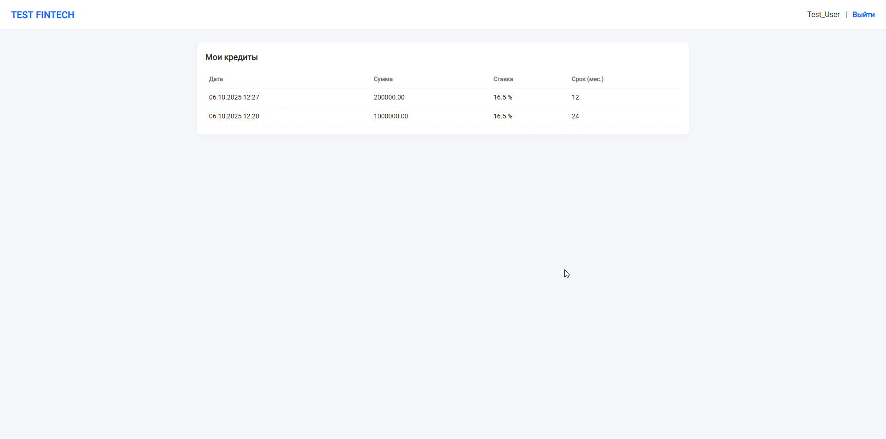

# 💳 FINTECH

Учебный проект на Django, реализующий основные механики финансовой платформы.  
Позволяет зарегистрированным пользователям совершать транзакции, брать кредиты и управлять балансом.

---

## 🚀 Основной функционал

- Регистрация и авторизация пользователей
- Уникальный **хэш** для каждого пользователя
  - транзакции ссылаются только на хэши (а не на пользователей напрямую)
  - обеспечивает неизменяемость данных: даже при смене имени/почты, транзакции остаются корректными
- Транзакции:
  - нельзя изменить или удалить
  - фиксируются с указанием отправителя и получателя
- Система кредитования:
  - автоматический расчет суммы кредита на основе текущей кредитной ставки
  - кредит по факту = транзакция от специального пользователя **BANK**
  - хэш банка и процентная ставка настраиваются через `settings.py`

---

## 📌 В планах
- Автоматическое списание ежемесячного платежа по кредиту с баланса
- Подсчет текущего баланса на основе всех транзакций пользователя
- Депозиты с автоматическим начислением процентов на счёт

---

## 🛠 Технологии
- Python 3.13
- Django 5
- SQLite (по умолчанию, возможен переход на PostgreSQL)
- Django ORM
- HTML, CSS (базовый UI)

---

## 📸 Скриншоты

### 🏠 Главная страница


### 💳 Оформление кредита


### 📋 Список кредитов пользователя


---

## 📦 Установка и запуск

Склонируйте проект:
```bash
git clone https://github.com/AskarUmurzakov/fintech.git
cd fintech

Установите зависимости:
pip install -r requirements.txt

Примените миграции и создайте суперпользователя:
python manage.py migrate
python manage.py createsuperuser

Запустите сервер:
python manage.py runserver

Проект будет доступен по адресу:
http://127.0.0.1:8000/

